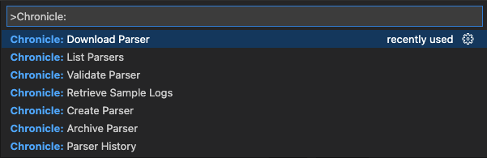

# Chronicle Parser Tools for Visual Studio Code

**Note: This extension is provided for educational purposes only and is not actively maintained. Feel free to fork and modify as needed.**

The VS Code **Chronicle Parser Tools** extension
provides rich support for the
Chronicle Tooling APIs, used to manage parsers for Chronicle environments.

## Quick Start
Welcome! 👋🏻

Whether you are new to Chronicle Parsers or are an experienced builder, we hope this
extension fits your needs and enhances your development experience.

* **Step 1.** If you haven't done so already, install the Chronicle Parser Tools extension.
  * [Managing extensions in VS Code].
* **Step 2.** Configure the following settings for connecting and authenticating to your Chronicle instance:
  *  `Service Account File Path`
  *  `Region`
  *  `Author`

You are now ready :-) &nbsp;&nbsp; 🎉🎉🎉

Please be sure to learn more about the many [features](#features) of this
extension.

## Features
This extension provides many features, including parser management, testing, and data generation support. You can access any of these by opening the Command Palette (`Ctrl+Shift+P` on Linux/Windows and `Cmd+Shift+P` on Mac), and then typing in the command name.

 
<em>(Command Palette options)</em>

In addition to [commands](#commands), the extension provides several opportunities for interaction based on the view.

For example, after creating or archiving a parser users can click the **Refresh (↹)** button to refresh the view and retrieve the latus status:

 
<em>(Command Palette options)</em>

Or navigating back to the List Parsers view by clicking on the **List Parsers** button, as shown:

 
<em>(Command Palette options)</em>

## Commands

### `Create Parser`

Creates a new parser, or overrides the existing one, given a configuration file and data type.

### `Download Parser`

Retrieves the given parser's configuration.

### `Validate Parser`

Tests a given parser configuration against a given log file outputting events and/or errors.

### `List Parser`

Returns a list of active parsers on the instance.

### `Retrieve Sample Logs`

Retrieves sample data from the Chronicle instance given a data type and start/end times.

### `Archive Parser`

Archives the given parser, removing it from the instance.

### `Parser History`

Returns the history of parsers for a given data type on the instance.

## Requirements
A valid Service Account JSON file used to authenticate to a Chronicle instance.

## Extension Settings
This extension contributes the following settings:

* `Author`: a string value used when creating a new parser
* `Region`: the region associated with the instance
* `Service Account File Path`: the file path to the JSON file used for authentication.

## License
**MIT**
